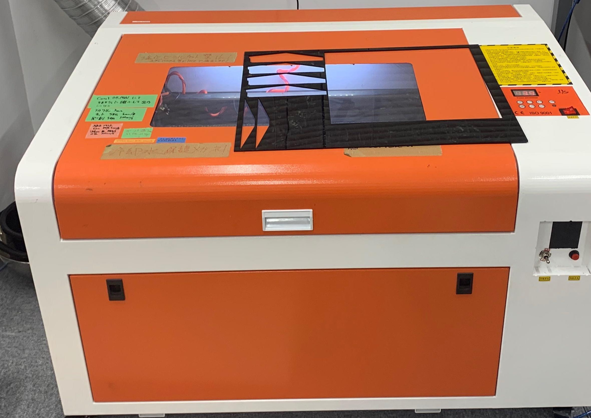

## 本日やったこと

1. cube-petit(Inventor編)
2. cube-petit(レーザ加工編)
---

## cube-petit(Inventor編)

### Inventor

[公式のチュートリアル動画](https://knowledge.autodesk.com/ja/support/inventor-products/getting-started/caas/CloudHelp/cloudhelp/2019/JPN/Inventor-Tutorial/files/GUID-25E3BABE-0FF4-4542-854E-AD2F59E4BB4A-htm.html)を見る。
* パーツファイルを組み合わせてアセンブリファイルを作成する
* 作成の流れ
    1. スケッチ作成
    2. パーツファイルの作成(.ipt)
    3. アセンブリファイルの作成(.iam)

#### 参考

[INVENTOR](https://knowledge.autodesk.com/ja/support/inventor?sort=score)
[Inventor NAVI](https://www.inventor-navi.net/about-inventor/)
[初めての方向け！Inventorの使い方まとめ](https://cad-kenkyujo.com/2019/06/29/inventor-modeling/)

### cube-petit構成

* 本体のアルミフレーム
* 天板のアルミフレーム
* 本体と天板のアルミフレーム
* モータとホイール(左右)
* センサー
* ディスプレイ
* 側のアクリル板
* 本体中身

#### (例)本体のアルミフレーム

1. アルミフレームのCADファイルをダウンロードし、アセンブリファイルに読み込む。
2. パーツの編集をする。長さを180[mm]に調整する。
3. 拘束を利用して固定していく
    * 基本的に3回固定する

---
## cube-petit(レーザ加工編)



### レーザ加工機の準備

1. 排気の用意
2. 冷却用の水準備
3. 保護メガネをかける
4. 電源ON
5. 蓋を開ける
6. アクリル材をセットする
7. 25[mm]の距離にセットする

#### Tips

* 蓋は慎重に開け閉めすること

---
### ソフトウェアの準備

1. CoralDrawの起動
2. カットしたいデータをドラッグドロップする
3. データ加工
    * [オブジェクト]-> 穴あきをなくす
    * サイズを98.6％にする(大きく印刷されてしまうバグ)
4. 右下の赤いアイコンを右クリックし、カットまたは彫刻を選択
5. 位置合わせをしてスタート

#### Tips

* 左下に点を置くとそこからスタートになる
* 何度も同じ位置でカットし続ける場合はループが閉じていないのでやり直しする
---
### データの準備

アクリル板をレーザ加工する際は、レーザによって材料が溶けるのでサイズを小さく設定する。\
辺を**0.3[mm]小さく**、穴は**0.3~0.5[mm]大きく**設定する。\

InventorからDXFファイルを作成する。
1. スケッチファイルを選択し、**「スケッチに名前をつけてエクスポート」**\
2. ファイルの種類は **「AutoCAD DXF(dxf)」** 
3. オプションでファイルのバージョンを **「AutoCAD R12/LT 2 DXF」**　にし保存
---
### パラメータについて

加工時のパラメータは**速度**と**出力**である。\
材質・厚さ・色によって異なるパラメータが必要で、強すぎるとアクリル板下のハニカムに当たるので
注意。詳細はパソコンの中のエクセルフォルダを見ること。


---
[トップへ](#本日やったこと)

<!--
```
プログラムを書く
```
-->


