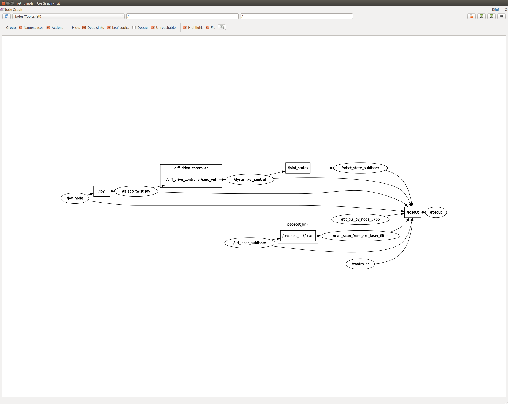
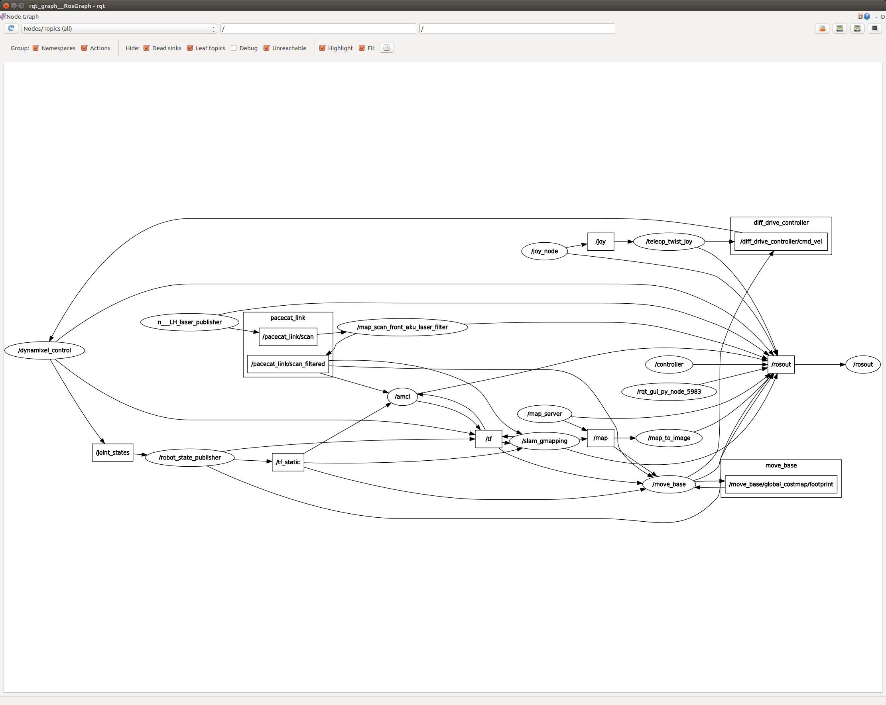

## 概要

1. cube-petit(cube_petit_gmappingについて)


---

## cube-petit(cube_petit_gmappingについて)

### 概要
cube-petitで地図作成を行う

### rqt_graphの結果

1. cube_petit_bringup.launchのみ
```roslaunch cube_petit cube_petit_bringup.launch```



2. cube_petit_gmapping.launchの起動後
```roslaunch cube_petit cube_petit_gmapping.launch```




### launchファイル

```/launch/cube_petit_gmapping.launch```の説明

```XML
<!-- -*- mode: XML -*- -->
<launch>
	<arg name="model" default="$(find cube_petit)/urdf/cube_petit.xacro" />
    <param name="robot_description" command="$(find xacro)/xacro $(arg model) --inorder"/>
    <arg name="scan" default="/pacecat_link/scan_filtered"/>

	<node name="slam_gmapping" pkg="gmapping" type="slam_gmapping" required="true" output="screen">	
		<remap from="scan" to="$(arg scan)"/>
		<param name="linearUpdate" value="0.1"/>
		<param name="angularUpdate" value="0.125"/>
		<param name="throttle_scans" value="1"/>
 		<param name="maxUrange" value="20.0"/>
		<param name="maxRange" value="20.0"/>
		<param name="delta" value="0.1"/>

		<!--param name="maxUrange" value="5.5"/>
		<param name="maxRange" value="5.5"/>
		<param name="minimumScore" value="50"/>
		<param name="temporalUpdate" value="5.0"/>
		<param name="delta" value="0.05"/-->
		<!-- <param name="base_frame" value="base_link" />
		<param name="odom_frame" value="odom" />
		<param name="maxUrange" value="4.0" />
		<param name="maxRange" value="4.0" />
		<param name="xmin" value="-15" />
		<param name="ymin" value="-15" />
		<param name="xmax" value="15" />
		<param name="ymax" value="15" />
		<param name="srr" value="0.1" />
		<param name="srt" value="0.1"/>
		<param name="str" value="0.1"/>
		<param name="stt" value="0.1"/>
		<param name="particles" value="30" /> -->

	</node>
	<!-- map convert to image node -->
	<param name="map_image/full/compressed/format" value="png" />
	<node name="map_to_image" pkg="hector_compressed_map_transport" type="map_to_image_node" output="screen">
		<remap from="pose" to="robot_pose" />
	</node>
	<!-- <node pkg="rviz" type="rviz" name="rviz"/> -->
</launch>
```

1. cube_petitのxacroファイルを指定する
    * パラメータ:robot_descriptionにcube_petitを指定する
    * トピック:scanに/pacecat_link/scan_filterdを指定する、これはLiDARの値で柱の部分を