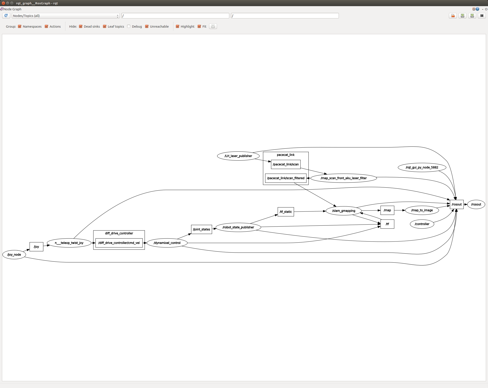

## 概要

1. cube-petit(cube_petit_gmappingについて)
2. cube-petit(configファイルについて)
3. cube-petit(cube_petit_navigationについて)
4. map_serverについて
---

## cube-petit(cube_petit_gmappingについて)

### 概要
cube-petitで地図作成を行う。地図作成にはgmappingパッケージを用いる

### rqt_graphの結果

1. cube_petit_bringup.launchのみ
```roslaunch cube_petit cube_petit_bringup.launch```


2. cube_petit_gmapping.launchの起動後
```roslaunch cube_petit cube_petit_gmapping.launch```



cube_petit_gmapping.launchで追加されるノードは、
* slam_gmapping
地図作成と自己位置推定を同時に行うノード。LiDARの値を元にmapトピックを出す
    * サブスクライブするトピック```/pacecat_link/scan_filtered tf_static```
    * パブリッシュするトピック```map tf```

* map_scan_front_aku_laser_filter
LiDARの値から柱の部分の値を切り取る処理をするノード
    * サブスクライブするトピック```/pacecat_link/scan```
    * パブリッシュするトピック```/pacecat_link/scan_filtered```

* map_to_image
マップ情報をpng画像に変換するノード
    * サブスクライブするトピック```map robot_pose```
    * パブリッシュするトピック```map_image/full map_image/tile```

### launchファイル

```/launch/cube_petit_gmapping.launch```の説明

```XML
<!-- -*- mode: XML -*- -->
<launch>
	<arg name="model" default="$(find cube_petit)/urdf/cube_petit.xacro" />
    <param name="robot_description" command="$(find xacro)/xacro $(arg model) --inorder"/>
    <arg name="scan" default="/pacecat_link/scan_filtered"/>

	<node name="slam_gmapping" pkg="gmapping" type="slam_gmapping" required="true" output="screen">	
		<remap from="scan" to="$(arg scan)"/>
		<param name="linearUpdate" value="0.1"/>
		<param name="angularUpdate" value="0.125"/>
		<param name="throttle_scans" value="1"/>
 		<param name="maxUrange" value="20.0"/>
		<param name="maxRange" value="20.0"/>
		<param name="delta" value="0.1"/>

		<!--param name="maxUrange" value="5.5"/>
		<param name="maxRange" value="5.5"/>
		<param name="minimumScore" value="50"/>
		<param name="temporalUpdate" value="5.0"/>
		<param name="delta" value="0.05"/-->
		<!-- <param name="base_frame" value="base_link" />
		<param name="odom_frame" value="odom" />
		<param name="maxUrange" value="4.0" />
		<param name="maxRange" value="4.0" />
		<param name="xmin" value="-15" />
		<param name="ymin" value="-15" />
		<param name="xmax" value="15" />
		<param name="ymax" value="15" />
		<param name="srr" value="0.1" />
		<param name="srt" value="0.1"/>
		<param name="str" value="0.1"/>
		<param name="stt" value="0.1"/>
		<param name="particles" value="30" /> -->

	</node>
	<!-- map convert to image node -->
	<param name="map_image/full/compressed/format" value="png" />
	<node name="map_to_image" pkg="hector_compressed_map_transport" type="map_to_image_node" output="screen">
		<remap from="pose" to="robot_pose" />
	</node>
	<!-- <node pkg="rviz" type="rviz" name="rviz"/> -->
</launch>
```

1. cube_petitのxacroファイルを指定する  
    * パラメータ:robot_descriptionにcube_petitを指定する  
    * トピック:scanに/pacecat_link/scan_filterdを指定する、これはLiDARの値で柱の部分をフィルタリングする
2. slam_gmappingノードを起動し地図作成を行う。パラメータは後で記述
3. map_to_image_nodeノードを起動し地図情報を画像に変換する

### gmappingで使用しているパラメータ

* linearUpdate (float, default: 1.0)  
　平行移動での観測の間隔。デフォルトで1m移動したら次のスキャンをする  
　今回は0.1m移動したら次のスキャンをする
* angularUpdate (float, default: 0.5)  
　角度方向のスキャンの間隔。0.5rad(28.6度)回転したあとに次のスキャンを行う  
　今回は0.125rad(7.2度)回転したあとに次のスキャンを行う
* throttle_scans(int, default: 1)
　何回スキャンするたびに１回処理を行うか、大きくするほど多くのスキャンをスキップする  
　大きくすると処理速度あがる
* maxURange  
　mappingを行うのに使うscanの最大検出距離  
　今回は20m
* maxRange(float)  
　Lidarの最大検出距離  
　もしセンサの範囲内に、障害物のない領域がマップに空き領域として表示される場合、maxUrande < センサの最大検出距離　<= maxRangeにする  
　今回は20m
* delta(float, default: 0.05)  
　マップの解像度。グリッド１辺の長さで初期は5cm  
　今回は0.1mつまり１グリッド10cm

### 使用していないパラメータ

#### ライダー値の処理

1. inverted_laser (string, default: "false")  
　スキャンの回転方向を半回転させるか,trueで時計回りでfalseで半時計回り  
　※現在はtransform dateを使う

#### 座標系の指定

2. base_frame (string, default: "base_link")  
　ロボットのベースリンク名を指定する
3. map_frame (string, default: "map")
　map名の指定
4. odom_frame (string, default: "odom")
　オドメトリ名の指定

#### スキャンマッチング

6. sigma (float, default: 0.05)：greedy endpointマッチングに使われる標準偏差？謎
7. kernelSize (int, default: 1)：対応を探すカーネル
8. lstep (float, default: 0.05)：トランスレーションに最適化するステップ
9. astep (float, default: 0.05)：回転に最適化するステップ
10. iterations (int, default: 5)//
　スキャンマッチの反復回数
11. lsigma (float, default: 0.075)  
　尤度計算に使用されるビーム1本の標準偏差
12. ogain (float, default: 3.0)  
　リサンプリング効果を平滑化するために、尤度を評価する際に使われるゲイン
13. lskip (int, default: 0)  
　各スキャンでスキップするビームの数。0ですべてのビームを取得する。(n+1)番目のレーザ光線のみ取得する
14. minimumScore (float, default: 0.0)  
　スキャンマッチングの効果を決める最低スコア。広い場所で、5mなど限られた範囲のレーザスキャナを使用する場合に、  
　姿勢位置推定の値が飛ぶことを回避する。スコアは600以上までいく  
　もしスキャンの値が飛んでいたら50に設定する

### オドメトリの誤差

rhoは半径値、thetaは角度

15. srr (float, default: 0.1)：平行移動に起因する平行移動の誤差(rho/rho)
16. srt (float, default: 0.2)：回転移動に起因する平行移動の誤差(rho/theta)
17. str (float, default: 0.1)：平行移動に起因するか回転移動の誤差(theta/rho)
18. stt (float, default: 0.2)：回転移動に起因する回転移動の誤差(theta/theta)

### マップ・tf更新頻度

5. map_update_interval (float, default: 5.0)  
　何秒に１回マップをアップデートするか。デフォルトで5秒で1回  
　値を下げると専有グリッドが頻繁に更新され計算不可が大きくなる
20. temporalUpdate (float, default: -1.0)  
　スキャン時間の間隔。ロボットが動いていなくてもこの時間が経過したらスキャンを行う。マイナスにセットすると無効化。
31. transform_publish_period (float, default: 0.05)  
　何秒に1度tfを発行するか、デフォルトで1秒に20回  
　0に設定すると無効化される  
　mapフレームからodomフレームのtfを発行する


### パーティクルフィルタ

21. resampleThreshold (float, default: 0.5)  
パーティクルフィルタのリサンプリングのしきい値  
Neffという値をにもとづく(1分の各パーティクルの尤度の２乗の総和)
22. particles (int, default: 30)  
パーティクル数、AMCLで可変、gmappingで固定
27. llsamplerange (float, default: 0.01)  
尤度の平行移動サンプリングの範囲
28. llsamplestep (float, default: 0.01)  
尤度の平行移動サンプリングステップ  
Translational sampling step for the likelihood
29. lasamplerange (float, default: 0.005)  
尤度の角度サンプリング範囲
30. lasamplestep (float, default: 0.005)  
尤度の角度サンプリングテップ  
Angular sampling step for the likelihood

### 初期マップサイズ

23. xmin (float, default: -100.0)  
初期マップのサイズ、x方向の下限。初期は100メートル
24. ymin (float, default: -100.0)  
初期マップのサイズ、y方向の下限。初期は100メートル
25. xmax (float, default: 100.0)  
初期マップのサイズ、x方向の上限。初期は100メートル
26. ymax (float, default: 100.0)  
初期マップのサイズ、y方向の上限。初期は100メートル

### 障害物を判定するしきい値

32. occ_thresh (float, default: 0.25)  
セルが障害物か決定するしきい値、グリッドセルで表現された各セルがこの値以上であれば障害物と判断  
(i.e., set to 100 in the resulting sensor_msgs/LaserScan)


### 参考URL

* [ROS gmapping のパラメータ解説](https://sy-base.com/myrobotics/ros/gmapping/)

---

## cube-petit(configファイルについて)

ファイル構成
- /cube_petit(/launch/include/move_base.launchから読み込み)
    - costmap_common.yaml
        - global_costmapとlocal_costmap両方で使用するパラメータ
    - costmap_global.yaml
        - global_costmapで使用するパラメータ
    - costmap_local.yaml
        - local_costmapで使用するパラメータ
    - move_base.yaml
        - navigation全体で使用するパラメータ

- amcl.yaml(/launch/include/amcl.launchから読み込み)
    - navigation時の自己位置推定に関するパラメータ
- cube_petit_aku_front.yaml(/launch/cube_petit_bringup.launchから読み込み)
    - LiDAR関連、何度の値をフィルタリングするか記述
- motor.yaml(/launch/motor_bringup.launchから読み込み)
    - モータ関連、dynamicel_controlのパラメータ
- odom.yaml(/launch/motor_bringup.launchから読み込み)
    - モータ関連、diff_drive_controller、gazebo_ros_control、joint_state_coontrollerのパラメータ
- ps3.config.yaml(/launuch/teleop_cube_petit.launchから読み込み)
    　- コントローラ関連

(以下未使用)
- costmap_global.yaml
- costmap_local.yaml
- joint_state_controller.yaml
- /cube_petit/costmap_explotion.yaml

### 上手な地図作成の方法

* 回転運動と並進運動を混ぜない
* 1m程度進んで地図が生成されるまで待ってからまた進む
* ゆっくり進む

---

## cube-petit(cube_petit_navigationについて)

### 概要
cube-petitで自律移動を行う、navigation stackの仕組みを説明する  
全体図は以下


メインとなるmove_baseと自己位置推定amclからなる。

### rqt_graphの結果

1. cube_petit_bringup.launchのみ
```roslaunch cube_petit cube_petit_bringup.launch```


2. cube_petit_navigation.launchの起動後
```roslaunch cube_petit cube_petit_navigation.launch```


cube_petit_navigation.launchで追加されるノードは、
* slam_gmapping
地図作成と自己位置推定を同時に行うノード。LiDARの値を元にmapトピックを出す
    * サブスクライブするトピック```/pacecat_link/scan_filtered tf_static```
    * パブリッシュするトピック```map tf```

* map_scan_front_aku_laser_filter
LiDARの値から柱の部分の値を切り取る処理をするノード
    * サブスクライブするトピック```/pacecat_link/scan```
    * パブリッシュするトピック```/pacecat_link/scan_filtered```

* map_to_image
マップ情報をpng画像に変換するノード
    * サブスクライブするトピック```map robot_pose```
    * パブリッシュするトピック```map_image/full map_image/tile```

### launchファイル

#### cube_petit_navigation.launch全体

```XML
<launch>
  <!--cube-petit -->
  <arg name="robot" default="cube_petit"/>
  <!--lidar topic name-->
  <arg name="scan" default="pacecat_link/scan_filtered"/>
 
  <!-- Navigation requires at least one map.
       In addition, it is sometimes desirable to have a "keepout" map
       which is used for costmaps, but not localization -->
  <arg name="map_file" default="$(find cube_petit)/map/daikaigisitu/map.yaml"/>
  <arg name="map_keepout_file" default="$(find cube_petit)/map/map_keepout.yaml" />
  <arg name="use_keepout" default="false" />
  <param name="map_server/map_file" value="$(arg map_file)" />

  <!-- If "costmap_image = true" launch costmap_to_image node -->
  <arg name="costmap_image" default="false" />

  <!-- Navigation parameter files -->
  <arg name="move_base_include" default="$(find cube_petit)/launch/include/move_base.launch.xml" />
  <arg name="amcl_include" default="$(find cube_petit)/launch/include/amcl.launch.xml" />

  <!-- serve up a map -->
  <node name="map_server" pkg="map_server" type="map_server" args="$(arg map_file)" />

  <!-- serve up a map with keepout zones -->
  <group if="$(arg use_keepout)" >
  <node name="map_keepout_server" pkg="map_server" type="map_server" args="$(arg map_keepout_file)" >
    <remap from="map" to="map_keepout" />
    <remap from="static_map" to="static_map_keepout" />
  </node>
  </group>

  <!-- localize the robot -->
  <include file="$(arg amcl_include)">
    <arg name="scan_topic" value="$(arg scan)"/>
  </include>

  <!-- move the robot -->
  <include file="$(arg move_base_include)" >
    <arg if="$(arg use_keepout)" name="map_topic" value="map_keepout" />
    <!--cube_kit, cuboid or signage -->
	<arg name="robot" value="$(arg robot)"/>
    <arg name="odom_topic" value="diff_drive_controller/odom" />

    <arg name="costmap_image" value="$(arg costmap_image)" />
  </include>

  <!-- <node pkg="cube_navigation" type="save_params.py" name="save_params" required="false" if="$(arg debug)" /> -->

</launch>

```

#### 最低限の部分のみ抽出

```XML
<launch>
  <!--cube-petit -->
  <arg name="robot" default="cube_petit"/>
  <!--lidar topic name-->
  <arg name="scan" default="pacecat_link/scan_filtered"/>
  
  <arg name="map_file" default="$(find cube_petit)/map/daikaigisitu/map.yaml"/>
  <param name="map_server/map_file" value="$(arg map_file)" />

  <!-- Navigation parameter files -->
  <arg name="move_base_include" default="$(find cube_petit)/launch/include/move_base.launch.xml" />
  <arg name="amcl_include" default="$(find cube_petit)/launch/include/amcl.launch.xml" />

  <!-- serve up a map -->
  <node name="map_server" pkg="map_server" type="map_server" args="$(arg map_file)" />

  <!-- localize the robot -->
  <include file="$(arg amcl_include)">
    <arg name="scan_topic" value="$(arg scan)"/>
  </include>

  <!-- move the robot -->
  <include file="$(arg move_base_include)" >
 	<arg name="robot" value="$(arg robot)"/>
    <arg name="odom_topic" value="diff_drive_controller/odom" />
  </include>

</launch>

```

##### 引数

* robot: 使用するロボット名、今回はcube_petit
* scan: 使用するLidarのトピック名、今回はPACECAT製LiDARを用いる
* map_file: 自律移動に使用するマップのパス
* move_base_include:```/launch/include/move_base.launch.xml```を指定
* amcl_include:```/launch/include/amcl.launch.xml```を指定

##### ROSパラメータ

* mapserver/map_file: マップファイルの指定、引数で設定する

##### 別launchファイル(include)

* ```/launch/include/amcl.launch.xml```
    * 引数：scan_topicにLidarのトピック名を指定
* ```/launch/include/move_base_include.launch.xml```
    * 引数：robotにロボット名を指定
    * 引数：odom_topicにodomのトピック名を指定

##### ノード

* map_server:マップトピックをpublishする

#### keepout, costmap有り

```XML

  <!-- Navigation requires at least one map.
       In addition, it is sometimes desirable to have a "keepout" map
       which is used for costmaps, but not localization -->
  <arg name="map_keepout_file" default="$(find cube_petit)/map/map_keepout.yaml" />
  <arg name="use_keepout" default="false" />

  <!-- If "costmap_image = true" launch costmap_to_image node -->
  <arg name="costmap_image" default="false" />

  <!-- serve up a map with keepout zones -->
  <group if="$(arg use_keepout)" >
  <node name="map_keepout_server" pkg="map_server" type="map_server" args="$(arg map_keepout_file)" >
    <remap from="map" to="map_keepout" />
    <remap from="static_map" to="static_map_keepout" />
  </node>
  </group>

  <include file="$(arg move_base_include)" >
    <arg if="$(arg use_keepout)" name="map_topic" value="map_keepout" />
    <arg name="costmap_image" value="$(arg costmap_image)" />
  </include>

```


### 参考URL

* [Navigation Stack を理解する - 1. 導入](https://qiita.com/MoriKen/items/0b75ab291ab0d95c37c2)
* [ROS Navigation Stack に関するもろもろ](https://qiita.com/ledmonster/items/8fbc9f7ea060a75e9018)
* [https://www.slideshare.net/hara-y/ros-slam-navigation-rsj-seminar](https://www.slideshare.net/hara-y/ros-slam-navigation-rsj-seminar)

---

### map_serverについて

イメージデータを読み取りROSサービス経由でマップを提供するノード  
現在はイメージデータの色情報を３つの値に変換する(空き:0 占有:100 不明:-1)  
(今後は0~100のより細かい占有率を用いる可能性あり)

#### コマンド

```rosrun map_server map_server map.yaml```

* Publishするトピック
    * map_metadata:マップのメタデータ、マップサイズや解像度など
    * map:マップデータ

* サービス名
    * static_map:このサービスを介してマップを取得する

* パラメータ名
    * frame_id:公開されたマップのヘッダに設定するフレーム

#### マップファイルの中身

```
image: testmap.png
resolution: 0.1
origin: [0.0, 0.0, 0.0]
occupied_thresh: 0.65
free_thresh: 0.196
negate: 0
```

* **image**: 占有データ(障害物の位置)を含む画像ファイルへのパス。絶対パスまたは相対パスで指定する
* **resolution**:マップの解像度。単位は [ meters/ pixel ]
* **origin**:(x,y,yaw)で表す左下ピクセルの二次元上の位置。yawは半時計回りへの回転(0の無回転)で、現在使わないシステムが多い
* **occupied_thresh**:これ以上だと完全に占有されている(障害物である)と判定するしきい値
* **free_thresh**:これ以下だと完全にフリーであると判定するしきい値
* **negate**:白/黒 空き/占有を反転させる。しきい値は影響を受けない
* **mode**: **オプション** trinary scale, rawから選ぶ、デフォルトはtrinary

##### negate/modeについて

[0,256)の色情報を持つピクセルをROSメッセージに入れるときにどう解釈するかをmodeオプションで指定する。  
まず、negateオプションによって整数を浮動小数点に変換する

* negateがfalse
    ```p = (255-x)/255.0``` 黒が1.0で白が0.0
* negateがtrue
    ```p = x / 255.0```

- modeがtrynary: 100 or 0 or -1
    - p > pregnant_threshの場合、セルの値は100で占有を表す
    - p < free_threshの場合、セルの値は0で空きを表す
    - それ以外は-1(aka 255)をunsigned charとして出力
- modeがscale: 100 or 0 or (0,100)
    - p > pregnant_threshの場合、セルの値は100で占有を表す
    - p < free_threshの場合、セルの値は0で空きを表す
    - それ以外は ```99 * (p - free_thresh) / (occupied_thresh - free-thresh)``` 
- modeがraw
    - そのまま0〜255の値を出力

#### map_saver

マップを保存する
```rosrun map_server map_saver [--occ <threshold_occupied>] [--free <threshold_free>] [-f <mapname>] ```
* occ,free:0~100の値