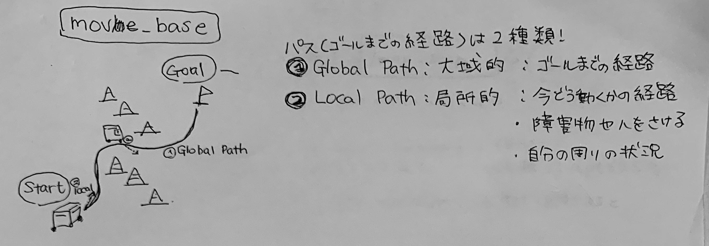
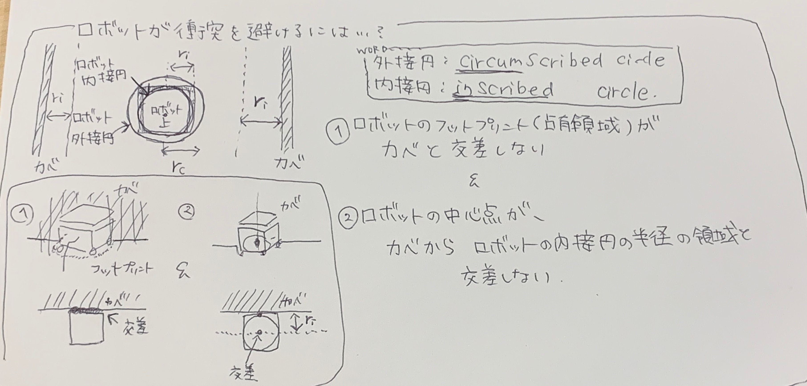
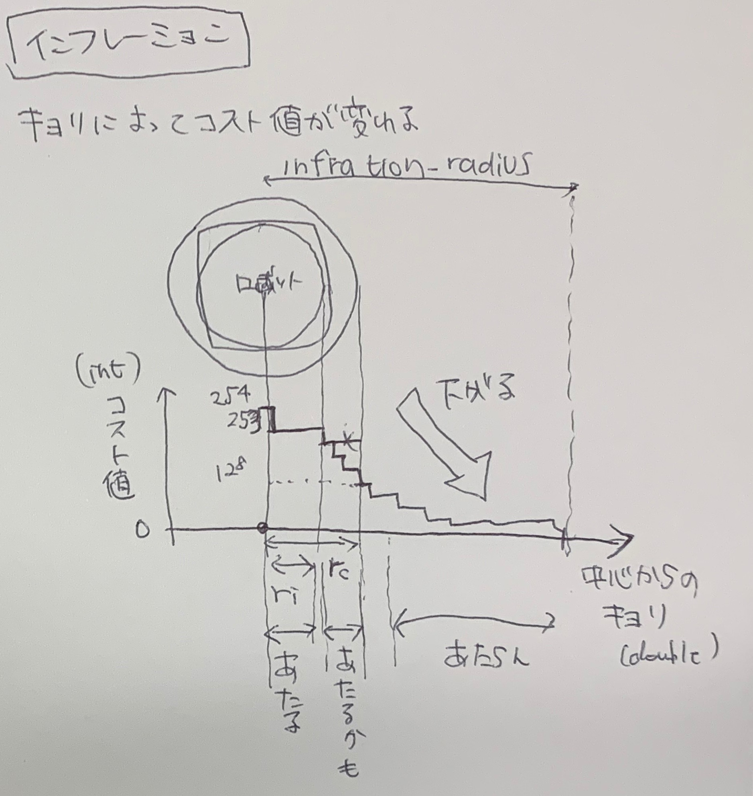

## 概要

1. move_baseについての調査
2. costmap_2dパッケージ

---

## 疑問点

* Costmap2dを使っている理由:扱いやすいから...?
    * 2択じゃなかった。選択肢はない解決
* costmap2dのinfrationは壁あたりのコストを計算しているのかロボット周りのコストを計算しているのか
    * 壁の周りのコストをロボットの内接円の長さ＋α分大きくしている
* combination_methodパラメータとは何と何のレイヤーを混ぜてる？
    * obstacleならstatic + obstacle? inflation layerで増やした値は...?

[navigation/costmap_2d/cfg/ObstaclePlugin.cfg](https://github.com/ros-planning/navigation/blob/melodic-devel/costmap_2d/cfg/ObstaclePlugin.cfg)
```
combo_enum = gen.enum([gen.const("Overwrite", int_t,  0, "Overwrite values"),
                       gen.const("Maximum",   int_t,  1, "Take the maximum of the values"),
                       gen.const("Nothing",   int_t, 99, "Do nothing")],
                       "Method for combining layers enum")
gen.add("combination_method", int_t, 0, "Method for combining two layers", 1, edit_method=combo_enum)
```

---

## move_baseについての調査

### 概要

move_baseは**ゴール**が与えられたとき

1. **地図/センサ/自己位置推定**の値から障害物の場所を表した**コストマップ**を作成し、  
2. コストマップからゴールまでの**経路を生成**し、
3. モータコントローラに**速度指令**を送る
パッケージである。  

### 経路

経路には２種類ある

* **Global Path**:**大域的**な経路と言われる、ゴールまでの経路
* **Local Path**:**局所的**な経路と言われる、今現在の自分の周りの状況をみて障害物や人を避けた経路



### コストマップ

２次元の**占有格子地図**という。マップに関しては[20200105.md](./20200105.md)のmap_serverについてを参照  
各グリッドの障害物っぽさを表す

* OccupancyGrid
    * 型名。int型で、各グリッドは0~100の値または-1(未知)
* Costmap2D
    * パッケージ名。unsigned char型で各グリッドを0~254の値または255(未知)で表す

### move_baseを構成する機能5つ

* global_planner
    * マップ情報から大まかにスタートからゴールまでのルートを計算し、local_plannerに投げる
* local_planner
    * センサ情報を用いて現在の障害物などの状況を確認しながらglobal_plannerの中の短期間のルートを計算する
    * 計算したルートから速度情報をモータコントローラに送る
* global_costmap: global_plannnerで使用するコストマップを作成する
* local_costmap: local_plannerで使用するコストマップを作成する

* recovery_behaviors: スタック状態(うごけなくなった時)に回復動作を行う

### action API

* goal:ゴール地点の場所
* cancel:設定したゴールをキャンセルする
* feedback:現在の場所をフィードバックする
* status:move_baseに送信する目標のステータス情報
* result:空

### サブスクライブトピック

* goal:ゴールの実行ステータスを知る必要がないときにmove_baseへの非アクションインターフェース？

### パブリッシュトピック

* cmd_vel:速度コマンド、ロボットを動かす

### サービス

* make_plan:経路計画だけ行い実行はしない

* clear_unknown_space:ロボット周辺の領域の不明な空間をクリアする。コストマップを長期間停止してから新しい場所で再開するとき

* clear_costmap:コストマップ内の障害物情報をクリアする

### パラメータ

* **base_global_planner**(string):グローバルプランナーのプラグイン名、デフォルトは"navfn/NavfnROS"
    * global_planner: navfnの改良版
    * **navfn**: ナビゲーション機能を使用して経路を計算する
    * carrot_planner: 障害物を回避しないでゴールに向かう
* **base_local_planner**(string):、デフォルトは"base_local_planner/TrajectoryPlannerROS"
    * **base_local_planner**: Dynamic Window Approachかtrajectory Rolloutを選択して経路生成をする
    * dwa_local_planner: 上の改良版、ホロノミックロボットのDWAより理解しやすく柔軟なy軸変数を追加
    * eband_local_planner: SE2マニホールドでElastic Bandメソッド
        * 狭い空間を移動するための経路平滑化
    * teb_local_planner: オンライン軌道最適化のためのTimed−Elastic−Bandメソッド
* **recovery_behaviors**(list):回復動作のプラグインのリスト
    * デフォルトは```[{name：conservative_reset、type：clear_costmap_recovery / ClearCostmapRecovery}, {name：rotate_recovery、type：rotate_recovery / RotateRecovery}、{name：aggressive_reset、type：clear_costmap_recovery / ClearCostmapRecovery}```
    * **clear_costmap_recovery**: ロボットから指定した半径より外のセンサによるコストマップをクリアする
        * conservative: 保守的な、conservative restで設定した範囲の半径分より外、デフォルト3[m]
        * aggressive: ロボット外接円の4倍の距離より遠い範囲を消す、デフォルト0.46[m]*4 = 1.84 [m]
    * **rotate_recovery**:ロボットを360ど回転させてスペースを空ける
* **controller_frequency**(double):move_baseループを実行し速度コマンドをパブリッシュする頻度、デフォルトは20[Hz]
* **planner_patience**(double):指定した秒数、有効な経路が見つからなければマップクリアする、デフォルトは5[sec]
* **controller_patience**(double):指定した秒数、有効な速度指令を受信しなければマップクリアする、デフォルトは15[sec]
* **conservative_reset_dist**(double):回復動作をするときに、指定した距離以上の障害物をコストマップから消す、デフォルトは3[m]
* **recovery_behavior_enabled**(bool):回復動作をするか、デフォルトはtrue
* **clearing_rotation_allowed**(bool):回復動作でその場回転するか、デフォルトはtrue
* **shutdown_costmaps**(bool):move_baseが非アクティブのときにコストマップを落とすか、デフォルトはfalse
* **occilation_timeout**(double):回復動作をする前に前後移動を何秒まつか、デフォルトは0.0でタイムアウトしない
* **occilation_distance**(double):この距離以下で移動すると振動しているとみなす、デフォルトは0.5[m]
* **planner_frequency**(double):グローバルプランナーを実行する周波数、デフォルトは0.0
    * デフォルト時は新しいゴールが来た時 or ローカルプランナーがそのパスがブロックされていることを報告した時？
* **max_planning_retries**(double):回復動作を取る前にプランナーを再実行する、デフォルトは-1
    * デフォルトで無限の再実行

---


## costmap_2dパッケージ

move_baseで使用しているコストマップを作成するパッケージで、センサの値から2dマップを作成する。  
マップデータとセンサデータから障害物の情報を更新する
Costmap2Dではコスト値は0~254を取り、**0は空きスペース**、**254は占有スペース**を表す。




## レイヤー

costmap_2dはレイヤーと呼ばれる複数のPluginから構成される、各レイヤーの機能を説明する

* **Static Map Layer**: **SLAM**によって生成されたものなど、コストマップのほとんど変化しない部分を表示
* **Obstacle Map Layer**: **センサ**データによって読み取られた部分の表示
    * **Obstacle Costmap Plugin**: 2次元データを扱う
    * **Voxel Costmap Plugin**: 3次元データを扱う
* **Infration Layer**: 障害物を膨張させることで**障害物周りにコストを追加**する、コストマップがロボットの構成空間を表す
(その他)
* Social Costmap Layer:人をコストマップに表示

上から順に実行される

### インフレーションとは

コストの値をロボットの中心セルからの距離が遠くなるほど減少させていくプロセス

5つの特徴的なシンボルを定義する

* **Lethal(253~254)**::致命的なコストで、ロボットの中心がそのセルにある場合明らかにぶつかっている
    * 253でロボットの内接円コスト値
* **Inscribed**(128~252)::内接コスト、セルがロボットの内接円より小さい場合でが確かにぶつかっている
* **Possibly circumsucribed**(1~127)::外接コスト、セルがロボットの外接円より大きい場合でぶつからない
* **Freespace**(0)::空き、
* **Unknown**(255)::データ無し



### サブスクライブトピック

* **footprint**(string): robot_base_frameの占有領域をリスト形式で表す、[[x1, y1], [x2, y2], ...., [xn, yn]]デフォルトは空リスト

### パブリッシュトピック

* **costmap**:コストマップの値
* **costmap_updates**:コストマップの更新された領域の値
* **voxel_grid**:3次元データを使用し、ユーザが3次元グリッドの公開を要求したときにpublishされる

### パラメータ

* **plugins**:plugin名を指定
* **global_frame**:フレーム名、デフォルトはmap
* **robot_base_frame**:ロボットのベースリンクのフレーム名、デフォルトはframe_link
* **rolling_window**:ウィンドウが回転するバージョンのコストマップを使用するか、static_mapがtrueならこれはfalse
* **always_send_full_costmap**:更新のたびにコストマップをすべてパブリッシュするかか否か
    * falseで変更部分だけがトピック**costmap_updates**にパブリッシュされる


### 各レイヤーのパラメータ

### costmap_2Dのパラメータ

* **transform_tolerance**(double):許容できるtfデータの遅延[sec],0.3[sec],0~10[sec]

    * 0.2秒は許容範囲内で8秒古いと許容範囲外
    * mapとbase_linkフレームの変換がros::Time::now()よりもこの秒古い場合、ロボットが停止する

* **update_frequency(double)**:マップ更新頻度、デフォルトで5[Hz],0~100[Hz]
* **publish_frequency(double)**:マップをパブリッシュする頻度、0[Hz],0~100[Hz]

#### map関連

static_map_layerで上書き可能な値

* **width**(int):マップの幅、単位はメートル、デフォルト10[m]
* **height**(int):マップの高さ、単位はメートル、デフォルト10[m]
* **resolusion**(double):マップの解像度で１セルのサイズ、単位は[m/cell]、デフォルトは0.05[m/cell]、最大値は50
* **origin_x**(double):globalフレームからのマップのx座標原点、単位は[m]、デフォルトは0[m]
* **origin_y**(double):globalフレームからのマップのx座標原点、単位は[m]、デフォルトは0[m]

#### robot footprint関連

* **footprint**(string): robot_base_frameの占有領域をリスト形式で表す、[[x1, y1], [x2, y2], ...., [xn, yn]]デフォルトは空リスト
* **robot_radius**(double):ロボットの半径、単位は[m]、円型のロボットのみ設定してそれ以外は設定しない、デフォルトは0.46[m]、最大は10[m]
* **footprint_padding**(double):ロボット占有領域のpadding、単位は[m]、デフォルトは0.1[m]

### infrationのパラメータ

* **cost_scaling_factor**(double):インフレーション時にコスト値に適用される係数、デフォルト10, 0~100
* **infration_radius**(double):地図が障害物のコスト値をふくらませる半径、デフォルト0.55[m],0~50[m]
* **inflate_unknown**(bool):未知のセルに適用するかどうか,デフォルトfalse

### obstacleのパラメータ

* **footprint_clearing_enabled**(bool):致命的な障害物のロボットの占有領域をクリアするか否か(?)、デフォルトTrue
* **max_obstacle_height**(double):コストマップに挿入される障害物の最題の高さ、デフォルト2[m],0~50[m]
* **combination_method**(int):2レイヤーを混ぜる方法。デフォルト1
    * それ以外のレイヤーから入ってくるデータに対してどう値を処理するか
    * 0  ならば上書きするので他レイヤーの値は使わない
    * 1  ならば受信したデータと自レイヤーを比較して最大値を取る、だいたいこれ
    * 99 ならば受信データを変更しない
    * track_unknown_spaceパラメータによってコストマップの動作が変わるので注意

(オプション：コメントアウト)

* **max_obstacle_range**(double):ロボットからこの距離までの障害物はコストマップに反映される、デフォルトは2.5[m]、0~50[m]
* **raytrace_range**(double):センサデータを使用して障害物を地図に反映させる範囲、デフォルトは3[m],0~50[m]

### voxelパラメータ

* **footprint_clearing_enabled**(bool):致命的な障害物のロボットの占有領域をクリアするか否か(?)、デフォルトTrue
* **max_obstacle_height**(double)t:コストマップに挿入される障害物の最題の高さ、デフォルト2[m],0~50[m]
* **orizin_z**(double):globalフレームからのマップのz座標原点、単位は[m]、デフォルトは0[m]
* **z_resolution**(double):マップの解像度で１セルの高さ、単位は[m/cell]、デフォルトは0.2[m/cell]、最大値は50
* **z_voxels**(int):各垂直列のボクセル数、デフォルト10個、0~16個
* **unknown_threshold**(int):１列で不明なセルの数がこの数以下なら、この列は知っているとみなされる、デフォルト15個、0~16個
    * 15なら、1セルの高さの中で１つ高さだけでもわかれば、その列は既知とみなす
* **mark_threshold**(int):マークされたセルの最大数、この列は開いているとみなされる、デフォルトは0,0~16
    * 0なら、１セルの高さの中で１つでも障害物があればそのセルは開いていない
* **combination_method**(int):2レイヤーを混ぜる方法。デフォルト1
    * それ以外のレイヤーから入ってくるデータに対してどう値を処理するか
    * 0  ならば上書きするので他レイヤーの値は使わない
    * 1  ならば受信したデータと自レイヤーを比較して最大値を取る、だいたいこれ
    * 99 ならば受信データを変更しない
    * track_unknown_spaceパラメータによってコストマップの動作が変わるので注意

---
