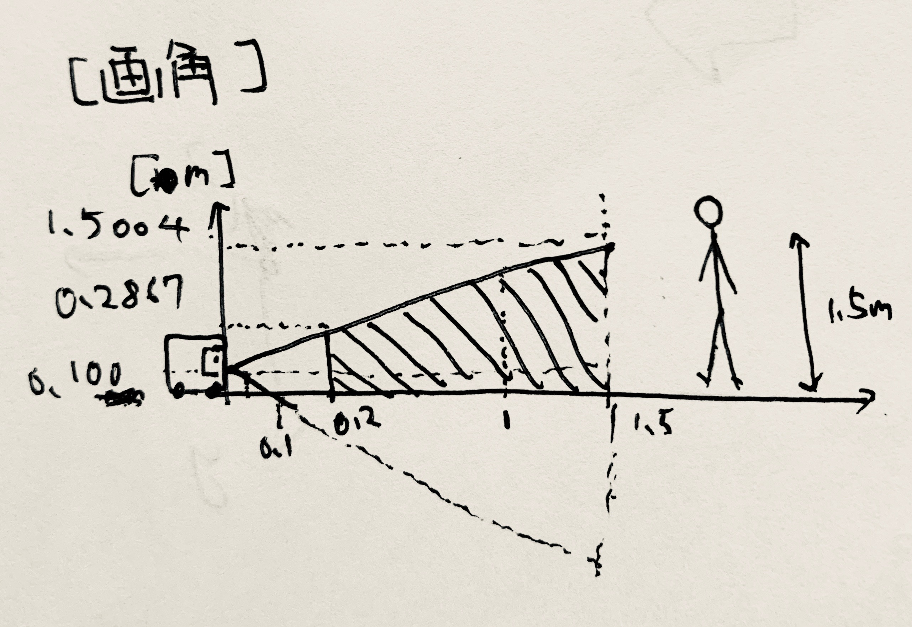
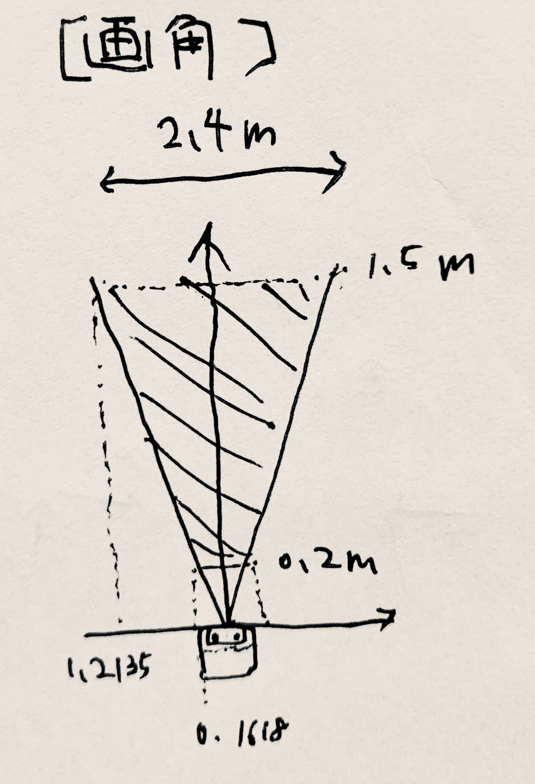

## 概要

1. cube-petit(openjtalk_speakerの導入)
2. REALSENSE導入(gazebo編)
3. SpatioTemporalVoxelLayer
4. カメラのキャリブレーション
---

## 疑問点

* base_line

---

## cube-petit(openjtalk_speakerの導入)

### インストール

```
cd ros/src/...
git clone https://github.com/sbgisen/openjtalk_speaker
cd openjtalk-speaker
catkin bt
~/.bashrc
```

### 実行方法

terminal1
```
roscore
```

terminal2
```
rosrun openjtalk-speaker jtalk.ros.py
```

terminal3
```
rostopic pub talk_sentence std_msgs/String "こんにちは"
```

### 例

1. ipアドレスを話す
```
ifconfig | grep 192.168.12. |sed 's/[\t ]\+/\t/g' | awk -F'[:\t]' '{print $4}'
```

---

## REALSENSE導入(gazebo編)

cube-petitにREALSENSE SR305(以下 REALSENSE)をつけてnavigationに利用する。

### SR305の仕様

urdf作成、シミュレーションに必要なパラメータを記述する  
* 対応範囲: 0.2[m] ~ 1.5[m]
* 深度カメラ
    * センサのタイプ: Structed Light Coding
    * min-z : 0.2[m]
    * 画角(FOV): 69+-3 x 54 +-2[度]
    * 解像度: 640x480
    * フレームレート:60fps

画角と対応距離からcube-petitが見える理想範囲を図で示す。  

横から見る、人の顔は見えなさそう


上から見る



### 流れ

1. urdfの作成
1. gazebo環境でrealsenseのシミュレーションをする
1. 実機検証

### 1. urdfの作成

```/urdf/cube_petit.xacro```に追記してcube-petitにREALSENSEのリンクとジョイントを作成する。  
REALSENSEはRGBカメラ、深度カメラ、赤外線カメラを搭載しているが、今回は深度カメラのみ使用する。  

座標系をロボットから見た座標系から画像処理するための光学座標系に変換する必要がある。  
深度カメラのリンク```realsense_link```からジョイント```depth_optical_joint```を追加し、光学座標系のリンク```realsense_optical_link```を作成する。  
**ROSの座標変換の計算順序がバグっているので注意**変換方法は```rpy = -1.57 0 -1.57```  

#### joint/linkの説明

* depth_joint: cube-petit筐体と深度カメラをつなげるジョイント
* realsense_link: 深度カメラのリンク
* depth_optical_joint: 深度カメラと深度カメラの光学座標系リンクをつなげるジョイント
* realsense_optical_link:深度カメラの光学座標系

#### gazeboプラグイン

gazebo上でREALSENSEのシミュレーションをするためgazeboプラグインを記述する。  
今回使用するのはkinect用のプラグイン```libgazebo_ros_openni_kinect.so```  
(REALSENSE用プラグイン[github/intel/gazebo-realsense](https://github.com/intel/gazebo-realsense)/[github/SyrianSpock/realsense_gazebo_plugin](https://github.com/SyrianSpock/realsense_gazebo_plugin/tree/kinetic-devel)は記事が少なかったため)  

深度カメラのリンクに追加する
```XML
<sensor type="depth" name="realsense">
      <always_on>true</always_on>
      <update_rate>4.0</update_rate>
      <camera>
        <!-- cameraのパラメータ -->
      </camera>
      <plugin name="kinect_camera_controller" filename="libgazebo_ros_openni_kinect.so">
        <!-- pluginのパラメータ -->
      </plugin>
    </sensor>
```

* センサのタイプ
    * camera
    * contact
    * depth
    * dorce_torque
    * gps
    * gpu_ray
    * imu
    * logical_camera
    * magnetometer
    * multicamera
    * ray
    * rfid
    * rfidtag
    * sonar
    * wireless_receiver
    * wireless_transmitter

##### cameraのパラメータ

```XML
        <horizontal_fov>${60.0*3.1415926/180.0}</horizontal_fov>
        <image>
          <format>R8G8B8</format>
          <width>640</width>
          <height>480</height>
        </image>
        <clip>
          <near>0.1</near>
          <far>5.0</far>
        </clip>
      </camera>
```

**horizontal_fov**:水平視野、画角。デフォルト1.047[rad]つまり60[度]
**image**:カメラ画像のサイズとフォーマット
    **format**:RGBのフォーマット
    **width**,**height**:画像の幅と高さのピクセル
**clip**: 画像生成する最短＆最長距離
    **near**:最短距離
    **far**:最長距離

##### openni_kinectのパラメータ

```XML
        <cameraName>camera</cameraName>
        <alwaysOn>true</alwaysOn>
        <updateRate>4</updateRate>
        <imageTopicName>realsense/image_color</imageTopicName>
        <depthImageTopicName>realsense/image_depth_rect</depthImageTopicName>
        <pointCloudTopicName>realsense/points</pointCloudTopicName>
        <cameraInfoTopicName>realsense/camera_info</cameraInfoTopicName>
        <!-- <depthImageCameraInfoTopicName>depth/camera_info</depthImageCameraInfoTopicName> -->
        <frameName>realsense_optical_link</frameName>
        <pointCloudCutoff>0.1</pointCloudCutoff>
        <pointCloudCutoffMax>5.0</pointCloudCutoffMax>
        <baseline>0.1</baseline>
        <distortion_k1>0.0</distortion_k1>
        <distortion_k2>0.0</distortion_k2>
        <distortion_k3>0.0</distortion_k3>
        <distortion_t1>0.0</distortion_t1>
        <distortion_t2>0.0</distortion_t2>
        <pointCloudCutoff>0.4</pointCloudCutoff>
```

###### カメラ全般

* **cameraName**:カメラの名前
* **alwaysOn**:```updateRate```によって常に値を更新するか
* **updateRate**:更新頻度

###### トピック/座標系名の指定

* **imageTopicName**:色画像
* **depthImageTopicName**:深度画像
* **pointCloudTopicName**:ポイントクラウド
* **cameraInfoTopicName**:カメラ情報
* **depthImageCameraInfoTopicName**:深度カメラ情報
* **frameName**:参照するリンク名

###### 最短距離・最長距離

* **pointCloudCutoff**:最小距離
* **pointCloudCutoffMax**:最長距離
* **baseline**:ベースライン距離、**カメラの距離？**
* **distortion_k1**: カメラの歪み係数(放射状) 負の値
* **distortion_k2**: 上同じ
* **distortion_k3**: 上同じ
* **distortion_t1**: カメラの歪み係数(タンジェント)
* **distortion_t2**: 上同じ

カメラの歪み係数を知るにはOpenCVのカメラキャリブレーションツールを用いる

#### 追加したソースコード

```XML
  <joint name="depth_joint" type="fixed">
    <parent link="body_link"/>
    <child link="realsense_link"/>
    <origin rpy="0 0 0" xyz="0.10137 0.0 0.10306"/>
  </joint>
  <link name="realsense_link">
    <inertial>
      <origin rpy="0 0 0" xyz="0.00000000 0.00000000 0.0000000"/>
      <mass value="0.11166745"/>
      <inertia
        ixx="0.004391"
        ixy="0.000000" iyy="0.004391"
        ixz="0.000000" iyz="0.000000" izz="0.004277"/>
    </inertial>
    <visual>
      <origin rpy="0 0 0" xyz="0 0 0"/>
      <geometry>
        <cylinder length="0.001" radius="0.001"/>
      </geometry>
      <material name="red"/>
    </visual>
    <collision>
      <origin rpy="0 0 0" xyz="0 0 0"/>
      <geometry>
        <cylinder length="0.001" radius="0.001"/>
      </geometry>
    </collision>
  </link>
  <gazebo reference="realsense_link">
    <mu1 value="0.5"/>
    <kp value="50000"/>
    <kd value="0"/>
    <sensor type="depth" name="realsense">
      <always_on>true</always_on>
      <update_rate>4.0</update_rate>
      <camera>
        <horizontal_fov>${60.0*3.1415926/180.0}</horizontal_fov>
        <image>
          <format>R8G8B8</format>
          <width>640</width>
          <height>480</height>
        </image>
        <clip>
          <near>0.1</near>
          <far>5.0</far>
        </clip>
      </camera>
      <plugin name="kinect_camera_controller" filename="libgazebo_ros_openni_kinect.so">
      <!-- <plugin name="realsense_camera_controller" filename="libRealSensePlugin.so"> -->
        <cameraName>camera</cameraName>
        <alwaysOn>true</alwaysOn>
        <updateRate>4</updateRate>
        <imageTopicName>realsense/image_color</imageTopicName>
        <depthImageTopicName>realsense/image_depth_rect</depthImageTopicName>
        <pointCloudTopicName>realsense/points</pointCloudTopicName>
        <cameraInfoTopicName>realsense/camera_info</cameraInfoTopicName>
        <!-- <depthImageCameraInfoTopicName>depth/camera_info</depthImageCameraInfoTopicName> -->
        <frameName>realsense_optical_link</frameName>
        <pointCloudCutoff>0.1</pointCloudCutoff>
        <pointCloudCutoffMax>5.0</pointCloudCutoffMax>
        <baseline>0.1</baseline>
        <distortion_k1>0.0</distortion_k1>
        <distortion_k2>0.0</distortion_k2>
        <distortion_k3>0.0</distortion_k3>
        <distortion_t1>0.0</distortion_t1>
        <distortion_t2>0.0</distortion_t2>
        <pointCloudCutoff>0.4</pointCloudCutoff>
      </plugin>
    </sensor>
  </gazebo>

  <joint name="depth_optical_joint" type="fixed">
    <parent link="realsense_link"/>
    <child link="realsense_optical_link"/>
    <origin rpy="-1.57 0 -1.57" xyz="0.0 0.0 0.0"/>
  </joint>
  <link name="realsense_optical_link">
    <inertial>
      <origin rpy="0 0 0" xyz="0.00000000 0.00000000 0.0000000"/>
      <mass value="0.11166745"/>
      <inertia
        ixx="0.004391"
        ixy="0.000000" iyy="0.004391"
        ixz="0.000000" iyz="0.000000" izz="0.004277"/>
    </inertial>
    <visual>
      <origin rpy="0 0 0" xyz="0 0 0"/>
      <geometry>
        <cylinder length="0.001" radius="0.001"/>
      </geometry>
      <material name="red"/>
    </visual>
    <collision>
      <origin rpy="0 0 0" xyz="0 0 0"/>
      <geometry>
        <cylinder length="0.001" radius="0.001"/>
      </geometry>
    </collision>
  </link>

```

#### Tips

* KinectのGazeboモデルはRGBの順番がBGRになっているので、```<format>B8G8R8</format>```と記述

### 2. gazebo環境でrealsenseのシミュレーションをする

```
roslaunch cube_petit cube_gazebo_pc.launch
```

navigationで利用するため、コストマップに設定を追加する。  
以下3ファイルに追記

#### costmap_common.yaml

```XML
rgbd_obstacles:
  enabled: true
  voxel_decay: 20     #seconds if linear, e^n if exponential
  decay_model: 0      #0=linear, 1=exponential, -1=persistent
  voxel_size:  0.05   #meters
  track_unknown_space: true   #default space is unknown
  observation_persistence: 0.0  #seconds
  max_obstacle_height: 1.2    #meters
  unknown_threshold: 15     #voxel height,
  mark_threshold: 0      #voxel height
  update_footprint_enabled: true
  combination_method: 1      #1=max, 0=override
  obstacle_range: 2.0    #meters
  origin_z: 0.0    #meters
  publish_voxel_map: true   # default off
  transform_tolerance: 0.2    # seconds
  mapping_mode: false  # default off, saves map not for navigation
  map_save_duration: 60     #default 60s, how often to autosave
  observation_sources: realsense_mark realsense_clear
  realsense_mark:
     data_type: PointCloud2
     topic: /camera/realsense/points
     marking: true
     clearing: false
     min_obstacle_height: 0.05   #default 0, meters
     max_obstacle_height: 1.5     #defaule 3, meters
     expected_update_rate: 0.0    #default 0, if not updating at this rate at least, remove from buffer
     observation_persistence: 0.0 #default 0, use all measurements taken during now-value, 0=latest 
     inf_is_valid: false          #default false, for laser scans
     clear_after_reading: true    #default false, clear the buffer after the layer gets readings from it
     voxel_filter: true           #default off, apply voxel filter to sensor, recommend on 
  realsense_clear:
     data_type: PointCloud2
     topic: /camera/realsense/points
     marking: false
     clearing: true
     min_obstacle_height: 0.05   #default 0, meters
     max_obstacle_height: 1.5     #defaule 3, meters
     expected_update_rate: 0.0    #default 0, if not updating at this rate at least, remove from buffer
     observation_persistence: 0.0 #default 0, use all measurements taken during now-value, 0=latest 
     inf_is_valid: false          #default false, for laser scans
     clear_after_reading: true    #default false, clear the buffer after the layer gets readings from it
     voxel_filter: true           #default off, apply voxel filter to sensor, recommend on 
```

##### 全般のパラメータ

* **enabled**: 機能を有効にする(true)か否(false)か
* **voxel_decay**: 格子の占有情報を消すまでの時間[sec] ```decay_model```によって減少する関数が異なる
* **decay_model**: 0,1,-1の値を取る、占有情報を消す時間を表す関数。0で線形に減少、1でe^nの関数で減少、-1で持続(減少しない)
* **voxel_size**:  格子サイズ[m]
* **track_unknown_space**: 未知の場所をtrackするか
* **observation_persistence**: 観測したデータの持続時間[sec]
* **max_obstacle_height**: 最大の高さ[m]
* **unknown_threshold**: １列で不明なセルの数がこの数以下なら、この列は知っているとみなされる、デフォルト15個、0~16個
* **mark_threshold**:マークされたセルの最大数、この列は開いているとみなされる、デフォルトは0,0~16
* **update_footprint_enabled**: footprintを更新するか？
* **combination_method**: 1,0の値を取る。コスト値に関して1で最大値を取り、0で上書きする
* **obstacle_range**: 2.0    #meters
* **origin_z**: globalフレームからのマップのz座標原点、単位は[m]、デフォルトは0[m]
* **publish_voxel_map**: 3次元マップをパブリッシュするか。デフォルトはfalse
* **transform_tolerance**: 許容できるtfデータの遅延[sec]
* **mapping_mode**: マップを保存するか。ナビゲーションには使用しないのでデフォルトはfalse  # default off, saves map not for navigation
* **map_save_duration**: どれくらいの頻度でマップを保存するか。デフォルトは60[sec]     #default 60s, how often to autosave
* **observation_sources**: 3次元地図にに占有情報をマーク・削除するために使用する名前

##### observation_sourcesのパラメータ


* **data_type**: データ形式の指定。PointCloud2
* **topic**: パブリッシュするトピック名
* **marking**: マークの場合はtrue、削除の場合はfalse
* **clearing**: 上の逆にする
* **min_obstacle_height**: 最小高さ、デフォルト0[m]
* **max_obstacle_height**: 最大高さ、デフォルト3[m]
* **expected_update_rate**: この頻度で更新されなければバッファから情報を消す。デフォルト0で無効
* **observation_persistence**: 現在時間としていした時間の間に取得されたすべての観測値を使用する。デフォルト0.0で最新のみ
* **inf_is_valid**: レーザスキャン用。デフォルトはfalse          #default false, for laser scans
* **clear_after_reading**: レイヤーがバッファから情報を取得したときにバッファをクリアする。デフォルトはfalse
* **voxel_filter**: true推奨、センサーにボクセルフィルタを適用するか。defaulfはfalse

#### costmap_global.yaml

```XML
rgbd_obstacles:
  voxel_decay:  30
  voxel_size: 0.1
plugins:
 - {name: rgbd_obstacles, type: "spatio_temporal_voxel_layer/SpatioTemporalVoxelLayer"}
```

#### costmap_local.yaml

```XML
rgbd_obstacles:
  voxel_decay:  10
  combination_method: 1
  decay_model: 0
plugins:
 - {name: rgbd_obstacles, type: "spatio_temporal_voxel_layer/SpatioTemporalVoxelLayer"}
```

### SpatioTemporalVoxelLayer

SpatioTemporalVoxelLayerは自律移動パッケージ```move_base```で使用するコストマップに、3次元空間での障害物データを与えるプラグインである。

* Spacio:OpenVBDと呼ばれる3次元グリッド上のデータを効率的に保存・操作するためのオープンソースのC++のライブラリを使用することでメモリ消費を減らす
* Temporal:格子の占有を時間とともに失効させる
    * ローカルコストマップの減衰時間前にロボットから入力されるすべての情報を利用する、5~15秒
    * グローバルコストマップで15~45秒

#### Install

apt-getからインストール可能
```sudo apt-get install ros-kinetic-spatio-temporal-voxel-layer```

#### 観測の有効化/無効化

ROSサービスを使う。コマンド例は以下。  

有効化：```rosservice call /move_base/global_costmap/rgbd_obstacle_layer/rgbd_back/toggle_enabled "data: true"```  
無効化：```rosservice call /move_base/local_costmap/rgbd_obstacle_layer/rgbd_back/toggle_enabled "data: false"```


### カメラのキャリブレーション

[ROS講座66 カメラのキャリブレーションを行う](https://qiita.com/srs/items/416aa78f2c679ddb7c52)を参考にreaksenseのカメラのキャリブレーションを行う。

#### パッケージインストール

```sudo apt-get install ros-kinetic-camera-calibration```

#### コマンド

terminal1:```roscore```  
terminal2:```roslaunch realsense2_camera rs_camera.launch```  
terminal3:```rosrun camera_calibration cameracalibrator.py --size 8x6 --square 0.025 image:=/camera/color/image_raw```  

確認方法コマンド
```
tar -xvzf /tmp/calibrationdata.tar.gz
cat ost.yaml
```

```
image_width: 640
image_height: 480
camera_name: camera
camera_matrix:
  rows: 3
  cols: 3
  data: [615.007227, 0.000000, 321.029234, 0.000000, 617.061451, 238.158865, 0.000000, 0.000000, 1.000000]
distortion_model: plumb_bob
distortion_coefficients:
  rows: 1
  cols: 5
  data: [0.145977, -0.284703, -0.003863, -0.002543, 0.000000]
rectification_matrix:
  rows: 3
  cols: 3
  data: [1.000000, 0.000000, 0.000000, 0.000000, 1.000000, 0.000000, 0.000000, 0.000000, 1.000000]
projection_matrix:
  rows: 3
  cols: 4
  data: [627.133789, 0.000000, 319.750084, 0.000000, 0.000000, 629.551147, 236.766759, 0.000000, 0.000000, 0.000000, 1.000000, 0.000000]
```

上から```distortion_coefficients```パラメータの値を見ることで歪み係数がわかる。  
```
k1 = 0.145977
k2 = -0.284703
p1 = -0.003863
p2 = -0.002543
p3 = 0.000000
```


### 参考

* [Intel RealSense™ SR305デプスカメラ](https://www.mouser.jp/new/intel/intel-sr305-depth-camera/)
    * realsenseの仕様
* [No.6-6:GazeboをROSに繋ぐ (ROSにおけるGazeboのプラグイン 編)](http://cir-kit.github.io/blog/2015/02/19/gazebo-gazebo-plugins-in-ros/)
    * gazeboプラグインの書き方
* [SDF Format](http://sdformat.org/spec?ver=1.6&elem=sensor)
    * SDFファイルのパラメータの説明
* [http://cir-kit.github.io/blog/2015/02/14/gazebo-camera-distortion/](http://cir-kit.github.io/blog/2015/02/14/gazebo-camera-distortion/)
    * カメラの歪み係数がk1~k3等
* [ROS KineticでのUSBカメラ接続とキャリブレーションまで](https://qiita.com/proton_lattice/items/aa805b28700575ba5ed3)
    * キャリブレーションの方法、係数を計算できる
* [spatio_temporal_voxel_layer](http://wiki.ros.org/spatio_temporal_voxel_layer)
    * 公式wiki

